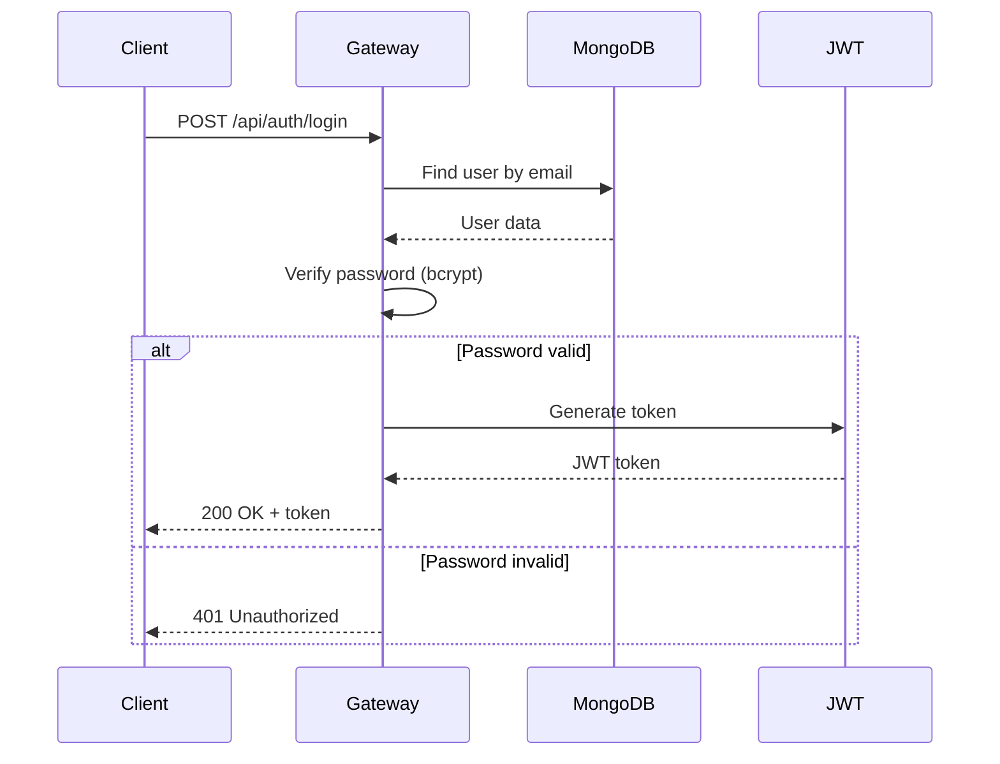
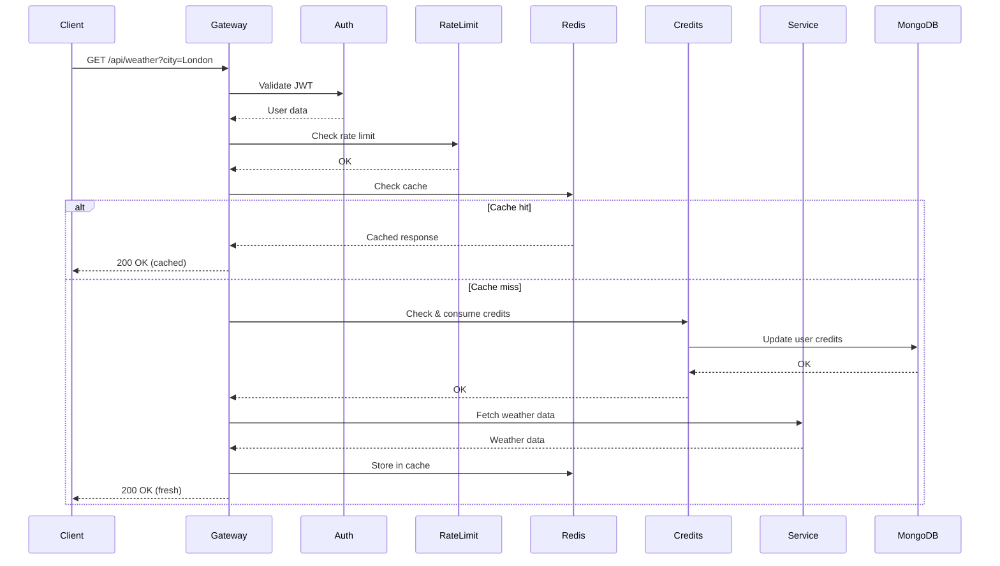
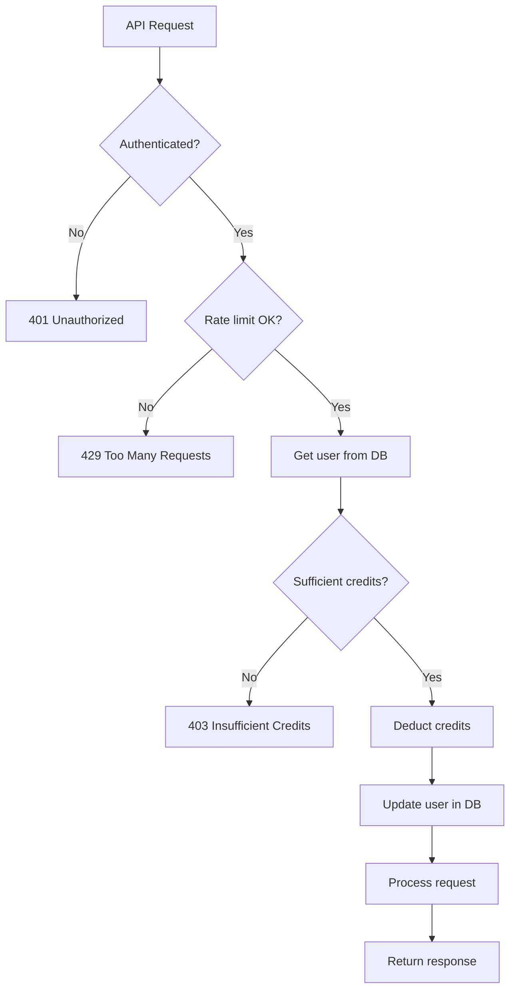

# API Gateway

A robust, production-ready API Gateway built with Node.js and Express that provides authentication, rate limiting, caching, credit-based usage tracking, and weather-based microservices.

## Table of Contents

- [Features](#features)
- [Architecture](#architecture)
- [Prerequisites](#prerequisites)
- [Installation](#installation)
- [Configuration](#configuration)
- [Running the Application](#running-the-application)
- [API Documentation](#api-documentation)
  - [Authentication](#authentication)
  - [Health Check](#health-check)
  - [Admin Endpoints](#admin-endpoints)
  - [API Endpoints](#api-endpoints)
- [Middleware](#middleware)
- [Services](#services)
- [Subscription Plans](#subscription-plans)
- [Project Structure](#project-structure)
- [Flow Diagrams](#flow-diagrams)
- [Troubleshooting](#troubleshooting)

## Features

✨ **Core Features:**
- 🔐 **JWT-based Authentication** - Secure token-based authentication
- 🚦 **Rate Limiting** - Plan-based request throttling
- 💾 **Redis Caching** - Response caching for improved performance
- 💳 **Credit System** - Usage-based billing with different subscription tiers
- 📊 **Structured Logging** - Winston-based logging with file rotation
- 🌡️ **Weather Services** - Integration with Open-Meteo API
- 🎯 **Role-based Access Control** - Admin and user roles
- 📦 **Response Compression** - Gzip compression for optimized bandwidth

## Architecture

The API Gateway follows a layered architecture:

```
┌─────────────────────────────────────────────────────────┐
│                     Client Request                       │
└─────────────────────┬───────────────────────────────────┘
                      │
                      ▼
┌─────────────────────────────────────────────────────────┐
│                  Express Middleware                      │
│  ┌──────────────────────────────────────────────────┐  │
│  │ Compression → Request Logger → Error Handler     │  │
│  └──────────────────────────────────────────────────┘  │
└─────────────────────┬───────────────────────────────────┘
                      │
                      ▼
┌─────────────────────────────────────────────────────────┐
│                    Route Layer                           │
│  /health → /api/auth → /admin → /api                    │
└─────────────────────┬───────────────────────────────────┘
                      │
                      ▼
┌─────────────────────────────────────────────────────────┐
│              Route-Specific Middleware                   │
│  Auth → Rate Limiter → Cache → Credit Check             │
└─────────────────────┬───────────────────────────────────┘
                      │
                      ▼
┌─────────────────────────────────────────────────────────┐
│                  Service Layer                           │
│  Weather → Clothing → Activity Services                 │
└─────────────────────┬───────────────────────────────────┘
                      │
                      ▼
┌─────────────────────────────────────────────────────────┐
│              External APIs / Database                    │
│  MongoDB (User Data) → Redis (Cache) → Open-Meteo API   │
└─────────────────────────────────────────────────────────┘
```

## Prerequisites

- **Node.js** >= 18.x
- **MongoDB** (local or cloud instance)
- **Redis** (local or cloud instance)
- **npm** or **yarn**

## Installation

1. **Clone the repository:**
   ```bash
   git clone <repository-url>
   cd api_gateway
   ```

2. **Install dependencies:**
   ```bash
   npm install
   ```

3. **Set up environment variables:**
   Create a `.env` file in the root directory:
   ```env
   # Server Configuration
   PORT=3000
   NODE_ENV=development

   # Database
   MONGO_URI=mongodb://localhost:27017/api_gateway

   # Redis
   REDIS_URL=redis://localhost:6379

   # JWT Secret
   JWT_SECRET=your-super-secret-jwt-key-change-this-in-production
   ```

## Configuration

### Subscription Plans

The system supports three subscription tiers defined in [`src/config/plans.js`](src/config/plans.js):

| Plan    | Total Credits | Weather Cost | Clothing Cost | Activity Cost | Rate Limit (req/min) |
|---------|---------------|--------------|---------------|---------------|----------------------|
| Go      | 100           | 1            | 5             | 5             | 2                    |
| Medium  | 500           | 1            | 3             | 3             | 3                    |
| Premium | 2000          | 1            | 1             | 1             | 4                    |

### Database Configuration

MongoDB connection is configured in [`src/config/db.js`](src/config/db.js). The connection string is read from the `MONGO_URI` environment variable.

### Redis Configuration

Redis client is configured in [`src/config/redis.js`](src/config/redis.js). The connection URL is read from the `REDIS_URL` environment variable.

## Running the Application

### Development Mode
```bash
npm run dev
```
This uses `nodemon` for auto-reloading on file changes.

### Production Mode
```bash
npm start
```

The server will start on port **3000** by default.

## API Documentation

### Base URL
```
http://localhost:3000
```

---

### Authentication

#### Login
Authenticate a user and receive a JWT token.

**Endpoint:** `POST /api/auth/login`

**Request Body:**
```json
{
  "email": "user@example.com",
  "password": "password123"
}
```

**Response (200 OK):**
```json
{
  "token": "eyJhbGciOiJIUzI1NiIsInR5cCI6IkpXVCJ9..."
}
```

**Error Responses:**
- `404 Not Found` - User not found
- `401 Unauthorized` - Invalid password
- `429 Too Many Requests` - Rate limit exceeded

**Rate Limiting:** Applied (5 requests/min for unauthenticated users)

---

### Health Check

#### Get System Health
Check the health status of the API Gateway and its dependencies.

**Endpoint:** `GET /health`

**Response (200 OK):**
```json
{
  "status": "UP",
  "timestamp": "2025-12-19T07:25:09.123Z",
  "uptime": 3600.5,
  "database": {
    "status": "connected",
    "readyState": 1
  }
}
```

**Response (503 Service Unavailable):**
```json
{
  "status": "DOWN",
  "timestamp": "2025-12-19T07:25:09.123Z",
  "uptime": 3600.5,
  "database": {
    "status": "disconnected",
    "readyState": 0
  }
}
```

**Authentication:** Not required

---

### Admin Endpoints

#### Create User
Create a new user with a specific subscription plan (Admin only).

**Endpoint:** `POST /admin/create-user`

**Headers:**
```
Authorization: Bearer <admin-jwt-token>
```

**Request Body:**
```json
{
  "email": "newuser@example.com",
  "password": "securepassword",
  "plan": "medium"
}
```

**Response (201 Created):**
```json
{
  "message": "User created",
  "user": {
    "email": "newuser@example.com",
    "plan": "medium",
    "credits": 500
  }
}
```

**Error Responses:**
- `400 Bad Request` - Invalid plan
- `401 Unauthorized` - Missing or invalid token
- `403 Forbidden` - Insufficient permissions (not admin)

**Authentication:** Required (Admin role)

---

### API Endpoints

All API endpoints require authentication and are subject to rate limiting and credit consumption.

**Common Headers:**
```
Authorization: Bearer <jwt-token>
```

---

#### Get Weather Data
Retrieve hourly weather forecast for a specified city.

**Endpoint:** `GET /api/weather`

**Query Parameters:**
- `city` (optional) - City name (defaults to "Delhi")

**Example Request:**
```bash
curl -X GET "http://localhost:3000/api/weather?city=London" \
  -H "Authorization: Bearer <token>"
```

**Response (200 OK):**
```json
{
  "latitude": 51.5074,
  "longitude": -0.1278,
  "hourly": {
    "time": ["2025-12-19T00:00", "2025-12-19T01:00", ...],
    "temperature_2m": [12.5, 12.3, 12.1, ...]
  }
}
```

**Features:**
- ✅ Authentication required
- ✅ Rate limiting applied
- ✅ Redis caching (1 hour TTL)
- ✅ Credit consumption (1 credit)

**Error Responses:**
- `401 Unauthorized` - Invalid or missing token
- `403 Forbidden` - Insufficient credits
- `404 Not Found` - City not found
- `429 Too Many Requests` - Rate limit exceeded

---

#### Get Clothing Advice
Get clothing recommendations based on current weather conditions.

**Endpoint:** `GET /api/clothing`

**Query Parameters:**
- `city` (optional) - City name (defaults to "Delhi")

**Example Request:**
```bash
curl -X GET "http://localhost:3000/api/clothing?city=Paris" \
  -H "Authorization: Bearer <token>"
```

**Response (200 OK):**
```json
{
  "service": "Clothing Advisory",
  "city": "Paris",
  "current_temperature": 18.5,
  "advice": "Mild. A light sweater or cardigan should be fine."
}
```

**Advice Logic:**
- **< 5°C:** "Freezing! Wear thermal layers, a heavy coat, gloves, and a hat."
- **5-15°C:** "Cold. Wear a warm jacket or coat."
- **15-24°C:** "Mild. A light sweater or cardigan should be fine."
- **≥ 24°C:** "Warm. T-shirt and shorts weather!"

**Features:**
- ✅ Authentication required
- ✅ Rate limiting applied
- ✅ Credit consumption (1-5 credits based on plan)

**Error Responses:**
- `401 Unauthorized` - Invalid or missing token
- `403 Forbidden` - Insufficient credits
- `429 Too Many Requests` - Rate limit exceeded

---

#### Get Activity Recommendations
Get outdoor activity suggestions based on current weather.

**Endpoint:** `GET /api/activity`

**Query Parameters:**
- `city` (optional) - City name (defaults to "Delhi")

**Example Request:**
```bash
curl -X GET "http://localhost:3000/api/activity?city=Tokyo" \
  -H "Authorization: Bearer <token>"
```

**Response (200 OK):**
```json
{
  "service": "Activity Planner",
  "city": "Tokyo",
  "current_temperature": 22.0,
  "advice": "Perfect weather for a run, hike, or picnic!"
}
```

**Advice Logic:**
- **< 5°C:** "Too cold for most outdoor activities. Maybe visit a museum or cafe?"
- **> 35°C:** "Risk of heat exhaustion. Stay hydrated and avoid strenuous outdoor exercise."
- **15-25°C:** "Perfect weather for a run, hike, or picnic!"
- **Other:** "Good for a brisk walk, but bring layers if you plan to stay out long."

**Features:**
- ✅ Authentication required
- ✅ Rate limiting applied
- ✅ Credit consumption (1-5 credits based on plan)

**Error Responses:**
- `401 Unauthorized` - Invalid or missing token
- `403 Forbidden` - Insufficient credits
- `429 Too Many Requests` - Rate limit exceeded

---

#### Service 1 & Service 2
Placeholder endpoints for future services.

**Endpoints:** 
- `GET /api/service1`
- `GET /api/service2`

**Response (200 OK):**
```json
{
  "message": "Service 1 response"
}
```

**Features:**
- ✅ Authentication required
- ✅ Rate limiting applied
- ✅ Credit consumption applied

---

## Middleware

### 1. Authentication (`auth.js`)
Validates JWT tokens and attaches user information to the request.

**Location:** `src/middleware/auth.js`

**Functionality:**
- Extracts token from `Authorization: Bearer <token>` header
- Verifies token using `JWT_SECRET`
- Attaches decoded user data to `req.user`

---

### 2. Rate Limiter (`rateLimiter.js`)
Implements plan-based rate limiting using `express-rate-limit`.

**Location:** `src/middleware/rateLimiter.js`

**Functionality:**
- Limits requests per minute based on user's subscription plan
- Uses user ID for authenticated requests, IP for unauthenticated
- Returns `429 Too Many Requests` when limit exceeded

**Configuration:**
- Window: 1 minute
- Limits: 2-4 requests/min (plan-dependent)

---

### 3. Cache (`cache.js`)
Implements Redis-based response caching.

**Location:** `src/middleware/cache.js`

**Functionality:**
- Caches responses in Redis with configurable TTL
- Uses request URL as cache key
- Intercepts `res.json()` to store responses
- Falls back to normal operation if Redis fails

**Usage:**
```javascript
router.get('/weather', cache(3600), weatherHandler) // Cache for 1 hour
```

---

### 4. Credit Consumption (`consumeCredits.js`)
Deducts credits based on API usage.

**Location:** `src/middleware/consumeCredits.js`

**Functionality:**
- Checks user's available credits
- Deducts credits based on API cost and plan
- Returns `403 Forbidden` if insufficient credits
- Updates user's credit balance in MongoDB

**Usage:**
```javascript
router.get('/weather', consumeCredits('weather'), weatherHandler)
```

---

### 5. Request Logger (`requestLogger.js`)
Logs all incoming requests with response time and status.

**Location:** `src/middleware/requestLogger.js`

**Functionality:**
- Logs request method, URL, status code, and duration
- Uses Winston for structured logging
- Logs errors to `error.log` and all requests to `combined.log`

---

### 6. Error Handler (`errorHandler.js`)
Global error handling middleware.

**Location:** `src/middleware/errorHandler.js`

**Functionality:**
- Catches all unhandled errors
- Returns standardized error responses
- Logs errors for debugging

---

### 7. Role-based Access Control (`role.js`)
Restricts access based on user roles.

**Location:** `src/middleware/role.js`

**Functionality:**
- Checks if user has required role (e.g., 'admin')
- Returns `403 Forbidden` if unauthorized

**Usage:**
```javascript
router.post('/create-user', auth, role('admin'), handler)
```

---

## Services

### Weather Service
Fetches weather data from Open-Meteo API.

**Location:** `src/services/weather.service.js`

**Features:**
- Geocoding to convert city names to coordinates
- Hourly temperature forecast retrieval
- Error handling for invalid cities

**External APIs:**
- Geocoding: `https://geocoding-api.open-meteo.com/v1/search`
- Weather: `https://api.open-meteo.com/v1/forecast`

---

### Clothing Service
Provides clothing recommendations based on current temperature.

**Location:** `src/services/clothing.service.js`

**Dependencies:** Weather Service

**Logic:**
- Fetches current temperature for specified city
- Provides advice based on temperature ranges
- Returns structured JSON response

---

### Activity Service
Suggests outdoor activities based on weather conditions.

**Location:** `src/services/activity.service.js`

**Dependencies:** Weather Service

**Logic:**
- Fetches current temperature for specified city
- Recommends activities based on temperature
- Warns about extreme conditions

---

## Subscription Plans

### Plan Details

#### Go Plan
- **Credits:** 100
- **Rate Limit:** 2 requests/min
- **API Costs:**
  - Weather: 1 credit
  - Clothing: 5 credits
  - Activity: 5 credits

#### Medium Plan
- **Credits:** 500
- **Rate Limit:** 3 requests/min
- **API Costs:**
  - Weather: 1 credit
  - Clothing: 3 credits
  - Activity: 3 credits

#### Premium Plan
- **Credits:** 2000
- **Rate Limit:** 4 requests/min
- **API Costs:**
  - Weather: 1 credit
  - Clothing: 1 credit
  - Activity: 1 credit

---

## Project Structure

```
api_gateway/
├── src/
│   ├── app.js                      # Express app configuration
│   ├── server.js                   # Server entry point
│   ├── config/
│   │   ├── db.js                   # MongoDB connection
│   │   ├── redis.js                # Redis client setup
│   │   ├── logger.js               # Winston logger configuration
│   │   └── plans.js                # Subscription plan definitions
│   ├── middleware/
│   │   ├── auth.js                 # JWT authentication
│   │   ├── cache.js                # Redis caching
│   │   ├── rateLimiter.js          # Rate limiting
│   │   ├── consumeCredits.js       # Credit deduction
│   │   ├── checkCredits.js         # Credit validation
│   │   ├── requestLogger.js        # Request logging
│   │   ├── errorHandler.js         # Error handling
│   │   └── role.js                 # Role-based access control
│   ├── models/
│   │   ├── User.js                 # User schema
│   │   └── ApiKey.js               # API key schema (if used)
│   ├── routes/
│   │   ├── auth.routes.js          # Authentication routes
│   │   ├── admin.routes.js         # Admin routes
│   │   ├── api.routes.js           # API routes
│   │   └── health.routes.js        # Health check routes
│   └── services/
│       ├── weather.service.js      # Weather data fetching
│       ├── clothing.service.js     # Clothing recommendations
│       └── activity.service.js     # Activity suggestions
├── .env                            # Environment variables (gitignored)
├── .gitignore                      # Git ignore rules
├── package.json                    # Dependencies and scripts
├── package-lock.json               # Dependency lock file
├── combined.log                    # All request logs
├── error.log                       # Error logs
└── README.md                       # This file
```

---

## Flow Diagrams

### Authentication Flow



### API Request Flow (with Caching)



### Credit Consumption Flow



---

## Troubleshooting

### Common Issues

#### 1. MongoDB Connection Failed
**Error:** `MongoDB connection failed`

**Solutions:**
- Verify MongoDB is running: `mongod --version`
- Check `MONGO_URI` in `.env` file
- Ensure MongoDB service is started
- Check network connectivity

---

#### 2. Redis Connection Error
**Error:** `Redis Client Error`

**Solutions:**
- Verify Redis is running: `redis-cli ping` (should return `PONG`)
- Check `REDIS_URL` in `.env` file
- Start Redis: `redis-server`
- Check Redis logs for errors

---

#### 3. Invalid Token
**Error:** `401 Unauthorized - Invalid token`

**Solutions:**
- Ensure token is included in `Authorization: Bearer <token>` header
- Verify `JWT_SECRET` matches between token generation and validation
- Check if token has expired (tokens don't expire by default in this implementation)

---

#### 4. Rate Limit Exceeded
**Error:** `429 Too Many Requests`

**Solutions:**
- Wait for the rate limit window to reset (1 minute)
- Upgrade to a higher subscription plan
- Check if multiple clients are using the same credentials

---

#### 5. Insufficient Credits
**Error:** `403 Forbidden - Insufficient credits`

**Solutions:**
- Check current credit balance
- Upgrade to a plan with more credits
- Contact admin to add credits manually

---

#### 6. City Not Found
**Error:** `404 Not Found - City not found`

**Solutions:**
- Verify city name spelling
- Use common city names (e.g., "London" instead of "Greater London")
- Try alternative spellings or nearby cities

---

### Debugging Tips

1. **Enable Debug Logging:**
   Set `NODE_ENV=development` in `.env` to enable console logging

2. **Check Log Files:**
   - `combined.log` - All requests
   - `error.log` - Error-level logs only

3. **Test Redis Connection:**
   ```bash
   node -e "require('./src/config/redis')"
   ```

4. **Test MongoDB Connection:**
   ```bash
   node -e "require('./src/config/db')()"
   ```

5. **Verify Environment Variables:**
   ```bash
   node -e "require('dotenv').config(); console.log(process.env)"
   ```

---

## Development

### Adding a New Service

1. Create service file in `src/services/`
2. Implement service logic
3. Add route in `src/routes/api.routes.js`
4. Apply middleware (auth, rate limiter, credits, cache)
5. Update plan costs in `src/config/plans.js`

**Example:**
```javascript
// src/services/myservice.service.js
module.exports = async (req, res, next) => {
  try {
    // Service logic here
    res.json({ message: 'My service response' })
  } catch (error) {
    next(error)
  }
}

// src/routes/api.routes.js
router.get('/myservice',
  consumeCredits('myservice'),
  cache(1800), // 30 min cache
  require('../services/myservice.service')
)
```

---

### Testing

**Manual Testing with cURL:**

```bash
# Login
TOKEN=$(curl -s -X POST http://localhost:3000/api/auth/login \
  -H "Content-Type: application/json" \
  -d '{"email":"user@example.com","password":"password"}' \
  | jq -r '.token')

# Get weather
curl -X GET "http://localhost:3000/api/weather?city=London" \
  -H "Authorization: Bearer $TOKEN"

# Get clothing advice
curl -X GET "http://localhost:3000/api/clothing?city=Paris" \
  -H "Authorization: Bearer $TOKEN"

# Check health
curl -X GET http://localhost:3000/health
```

---

## License

ISC

---

## Support

For issues, questions, or contributions, please contact the development team or create an issue in the repository.

---

**Built with ❤️ using Node.js, Express, MongoDB, and Redis**
